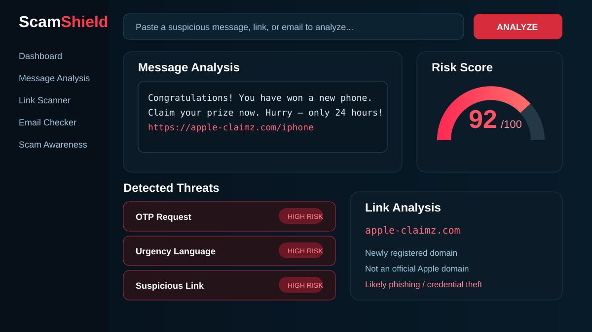

  

# ScamShield

An explainable scam and phishing detection project focused on identifying suspicious messages, risky links, OTP requests, urgency language, prize scams, and financial manipulation signals.

## Preview

The graphics above summarize the project’s core detection flow and the major risk signals ScamShield is designed to surface.

## Core capabilities

- Detect suspicious OTP or credential requests
- Flag risky or unusual links
- Identify urgency and pressure language
- Detect prize and giveaway scam patterns
- Highlight financial or payment requests
- Produce an understandable risk result instead of only a raw warning
- Keep the project presentation clean and GitHub-ready

## Repository visuals

`assets/preview.svg` — main project overview  
`assets/features.svg` — feature-focused visual

## Author

Built by **Shaik Arfan** as part of the **AFX** project collection.
